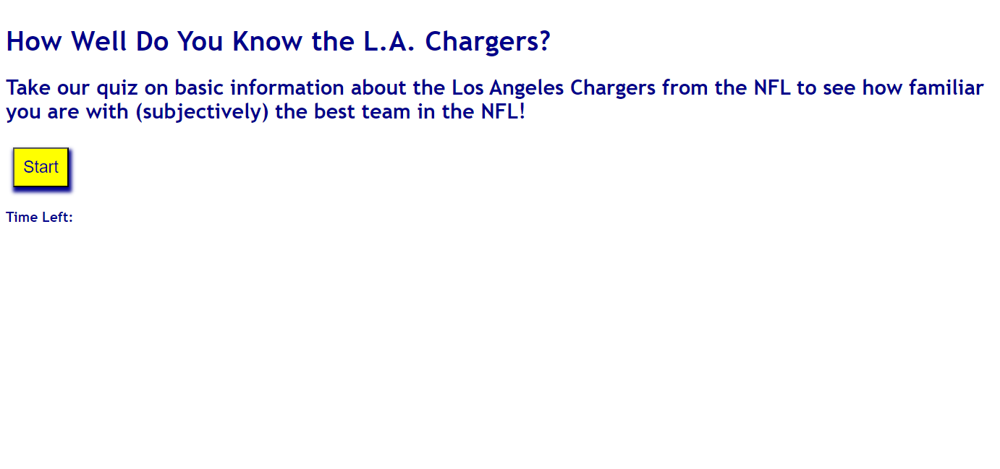

# LA-Chargers-Quiz
A quiz on the LA Chargers of the NFL

## Description

This is a 3-question quiz on the LA Chargers. Each wrong answer will subtract 10 seconds from the timer. Correct answers will result in no deduction. The final score will be the time left upon completion of the quiz, and then you will have the ability to save your score.

### List of Features 

1. The "start" button will start the quiz.
2. The timer will start.
3. You will answer 3 questions by selecting the option buttons.  
4. You will receive a 10 second deduction for wrong answers, and no deduction for correct answers.
5. Your final score will be equivalent to the time remaining upon completion.
6. You can save your score with your initials. 

### Usage

This application can be used to test the user's basic knowledge on the LA Chargers.

### Preview:

